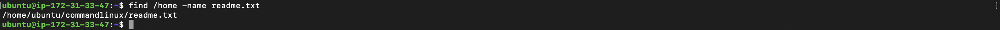
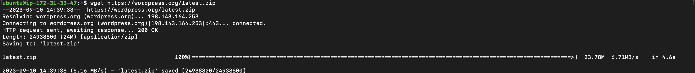

# This is Linux Command Project

---
*Linux is a Unix-Like operating system*

## Commands
*A linux command is a program or utility that runs on the CLI-a console that interacts with the susyem via text and processes*

1. ### **sudo command**

>This command is often use to access the root from the regular user account.
  >+ Here is the general syntax (e.g apt upgrade)

*the command to run is*

`sudo apt upgrade`

2. ### **pwd command**

>It is used to find the present working directory
   +The syntax is pwd [option]

*the command to run is*

`pwd`

3. ### **cd command**

>It is used to navigate through Linux files and directories. You can invoke it by specifying a folder to move into
+The syntax is [cd CommandsLinux]

*Now,we can run the below command*

`cd /home/ubuntu/CommandsLinux`

4. ### **ls commands:**

>This is used to list the files and directories in a system, using the below command

`ls`

>If you add a folder name or path, it will print that folder contents.

For example:

`ls -R`

5. ### **cat command:**

>In its simplest usage, `cat` prints a file's content to the standard output:

`cat`

>For example ,lets run:

`cat sqlite_commands.sh`

6. ### **cp command**

>This is used to copy a file or folder.
>
>Let us run an examples of `cp`

`cp sqlite_commands.sh /home/ubuntu/unixcommands`

7. ### **mv command**

>This is basically used for move and rename files and directories
>Simply type `mv` followed by filename and thhe destination directory

>An example is:

`mv `

`mv sqlite_commands1.sh /home/ubuntu/commandlinux`

8. ### **mkdir**

>This is used to create one or multiple directories.
>Let's create a sample folder using `mkdir`
>
`mkdir Quran`

9. ### **rmdir**

>This is used to permanently delete an emply directory
>Now, let's run a sample command for `rmdir`
>

`rmdir Quran/chapter`

10. ### **rm command**

>The `rm` is used to delete a file within a directory
>A general example is `rm filename`
>Now lets try to run a command

`rm fish`

11. ### **touch**

>It allows user to create an empty file or generate and modify a time stamp in the linux command line
>For example `touch file_name`

>The command can be run as

`touch cat`

12. ### **locate command**

>It finds a file name in the database sysytem

`locate file1`

13. ### **find command**

>It is used to search for file in a specific directory.

`find`

>An example is:

`find /home -name readme.txt`

14. ### **grep command**

>`grep` let's us find a word by searching through all the text in a specific folder
>
>An example goes thus:

`grep value sqlight_commands.sh`

15. ### **df command**

>It is basically used to report the system disk's storage
>
>It can simply be run as 

`df -h`

16. ### **du command**

>It is used to check how much space a file or directory is taking
>
>An example is:
>
>`du /home/ubuntu/commandlinux`

17. ### **head command**

>This `head` allows user to view the first ten lines of a text
>
>An example is:

`head uniqcommands`

18. ### **tail command**

>This `tail` command is used to display the last ten lines of a file.
>
>A general syntax is :

`tail [option] [file]`

An example is:

`tail -n sqlight_commands.sh`

19. ### **diff command**

>This`diff` command compares two contents of a file line by line.
>
>An example is :

`diff uniqcommands.sh sqlcommand.sh`

20. ### **tar command**

This `tar` command archives multiple files into a TAR file.

An example is :

`tar -cvf newarchive.tar /home/ubuntu`

21. ### **chmod command**

>This is a command that modifies a file or directory read's write and execution permission'
>
>Below is the basic syntax

`chmod [option] permission [filename]`

>An example is :

`chmod 777 unixcommands`

22. ### **chown command**

23. ### **jobs command**

>This is a process that the shell starts.
>
> `jobs [options] jobID`

An example is:

`jobs ID`

24. ### **kill command**

>This is used to terminate an unresponsive programme manually.
>
>The process Id number is needed, but if it isn't available, run 

`pu ux`

Then run:

`kill [signal_option] pid`

25. ### **ping command**

>This `ping` command is used to check whether a network or server is reachable.
>
>The general format is 

`ping [option] [hostname_or_IP address]`

>An example is:

`ping google.com`

26. ### **wget command**

This `wget` commands allows user to download files from the internet.

This command can simply be run as :

`wget [option] url`

An example is:

`wget https://wordpress.org/latest.zip`

27. ### **uname command**

>This command allows user to print detailed information about the linux hardware
>
>An example is :

`uname -a`

28. ### **top command**

>This command allows user to see all running process and a dynamic real time view of the current system.
>
>It is very easy to run, simply enter:

`top`

29. ### **history command**

>This commands allows user to view up to 500 previous executed commands.
>
>To run it, simply enter:

`history [option]`

30. ### **man command**

>This commands allows user to to view the manual of any commands or utility 
>The general syntax is
>`man command_name`

>Let's take an example:

`man ls`

31. ### **echo command**

>This is a command that is built-in utility that displays a line of text or string using thhe standard output
>
>An example is:

`echo -n`

32. ### **zip,unzip command**

>The `zip` command compresses file into ZIP, while `unzip` removes the ZIP from a file.
>
An example is:

`zip archive.zip note.txt`

33. ### **hostname command**

>This command allows user to know the system's hostname
>
>An example is :

`hostname -i`

35. ### **useradd,useradd commands**

>`useradd` is used to create a new user account.
>
>An example is:

`useradd -m akin`

>To add a password to the new user account.
>
`passwd akin`

36. ### **apt-get command**

>A command line tool responsible for handling Advanced Package Tool(APT) libraries in Linux
>
>An example is:

`apt-get firefox`

37. ### **nano, vi, jed commands**

>It allows user to edit and manage files via text editor, suchh as nano or vi
>
>An example is:

`nano`

38. ### **alais**

>This commands allows user to create a shortcut with the same fuctionality as a command, file name, or text.
>
>An example is:

`alias k=kill`

39. ### **su command**

>This allows a user to run a program as a different user.
>
>An example is:

`su -`

40. ### **ps command**

>This command prints all runnning process in your system
>
>An example is:
>
`ps command`

